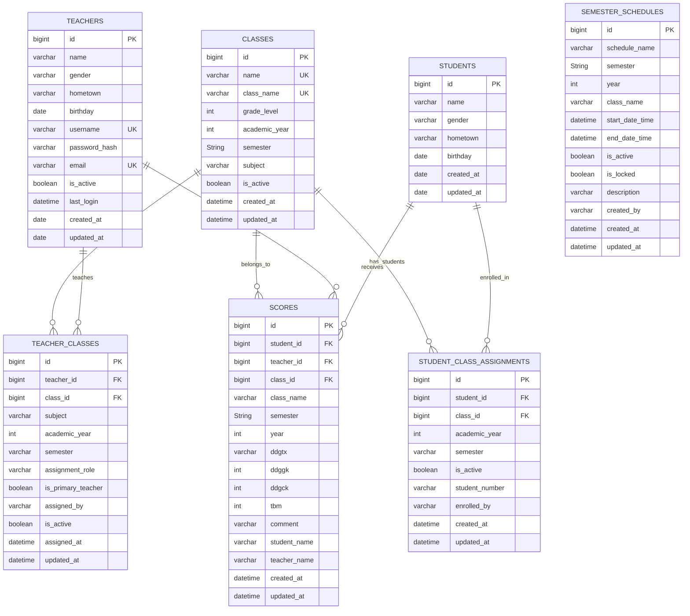

```mermaid
erDiagram
    TEACHERS {
        bigint id PK
        varchar name
        varchar gender
        varchar hometown
        date birthday
        varchar username UK
        varchar password_hash
        varchar email UK
        boolean is_active
        datetime last_login
        date created_at
        date updated_at
    }

    STUDENTS {
        bigint id PK
        varchar name
        varchar gender
        varchar hometown
        date birthday
        date created_at
        date updated_at
    }

    CLASSES {
        bigint id PK
        varchar name UK
        varchar class_name UK
        int grade_level
        int academic_year
        String semester
        varchar subject
        boolean is_active
        datetime created_at
        datetime updated_at
    }

    TEACHER_CLASSES {
        bigint id PK
        bigint teacher_id FK
        bigint class_id FK
        varchar subject
        int academic_year
        varchar semester
        varchar assignment_role
        boolean is_primary_teacher
        varchar assigned_by
        boolean is_active
        datetime assigned_at
        datetime updated_at
    }

    STUDENT_CLASS_ASSIGNMENTS {
        bigint id PK
        bigint student_id FK
        bigint class_id FK
        int academic_year
        varchar semester
        boolean is_active
        varchar student_number
        varchar enrolled_by
        datetime created_at
        datetime updated_at
    }

    SCORES {
        bigint id PK
        bigint student_id FK
        bigint teacher_id FK
        bigint class_id FK
        varchar class_name
        String semester
        int year
        varchar ddgtx
        int ddggk
        int ddgck
        int tbm
        varchar comment
        varchar student_name
        varchar teacher_name
        datetime created_at
        datetime updated_at
    }

    SEMESTER_SCHEDULES {
        bigint id PK
        varchar schedule_name
        String semester
        int year
        varchar class_name
        datetime start_date_time
        datetime end_date_time
        boolean is_active
        boolean is_locked
        varchar description
        varchar created_by
        datetime created_at
        datetime updated_at
    }

    %% Relationships
    TEACHERS ||--o{ TEACHER_CLASSES : "teaches"
    CLASSES ||--o{ TEACHER_CLASSES : "assigned_to"
    STUDENTS ||--o{ STUDENT_CLASS_ASSIGNMENTS : "enrolled_in"
    CLASSES ||--o{ STUDENT_CLASS_ASSIGNMENTS : "has_students"
    STUDENTS ||--o{ SCORES : "receives"
    TEACHERS ||--o{ SCORES : "gives"
    CLASSES ||--o{ SCORES : "belongs_to"
```
