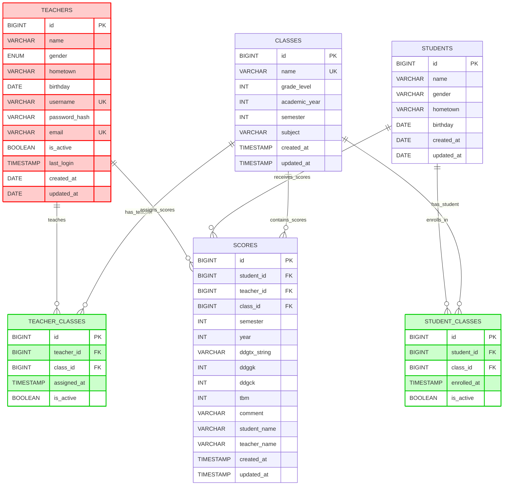

```mermaid
erDiagram
    TEACHERS {
        BIGINT id PK
        VARCHAR name
        ENUM gender
        VARCHAR hometown
        DATE birthday
        VARCHAR username UK
        VARCHAR password_hash
        VARCHAR email UK
        BOOLEAN is_active
        TIMESTAMP last_login
        DATE created_at
        DATE updated_at
    }

    STUDENTS {
        BIGINT id PK
        VARCHAR name
        VARCHAR gender
        VARCHAR hometown
        DATE birthday
        DATE created_at
        DATE updated_at
    }

    CLASSES {
        BIGINT id PK
        VARCHAR name UK
        INT grade_level
        INT academic_year
        INT semester
        VARCHAR subject
        TIMESTAMP created_at
        TIMESTAMP updated_at
    }

    TEACHER_CLASSES {
        BIGINT id PK
        BIGINT teacher_id FK
        BIGINT class_id FK
        TIMESTAMP assigned_at
        BOOLEAN is_active
    }

    STUDENT_CLASSES {
        BIGINT id PK
        BIGINT student_id FK
        BIGINT class_id FK
        TIMESTAMP enrolled_at
        BOOLEAN is_active
    }

    SCORES {
        BIGINT id PK
        BIGINT student_id FK
        BIGINT teacher_id FK
        BIGINT class_id FK
        INT semester
        INT year
        VARCHAR ddgtx_string
        INT ddggk
        INT ddgck
        INT tbm
        VARCHAR comment
        VARCHAR student_name
        VARCHAR teacher_name
        TIMESTAMP created_at
        TIMESTAMP updated_at
    }

    %% Relationships
    TEACHERS ||--o{ TEACHER_CLASSES : "teaches"
    CLASSES ||--o{ TEACHER_CLASSES : "has_teacher"
    
    STUDENTS ||--o{ STUDENT_CLASSES : "enrolls_in"
    CLASSES ||--o{ STUDENT_CLASSES : "has_student"
    
    TEACHERS ||--o{ SCORES : "assigns_scores"
    STUDENTS ||--o{ SCORES : "receives_scores"
    CLASSES ||--o{ SCORES : "contains_scores"

    %% Security Notes
    classDef security fill:#ffcccc,stroke:#ff0000,stroke-width:2px
    classDef junction fill:#ccffcc,stroke:#00cc00,stroke-width:2px
    
    class TEACHERS security
    class TEACHER_CLASSES junction
    class STUDENT_CLASSES junction
```